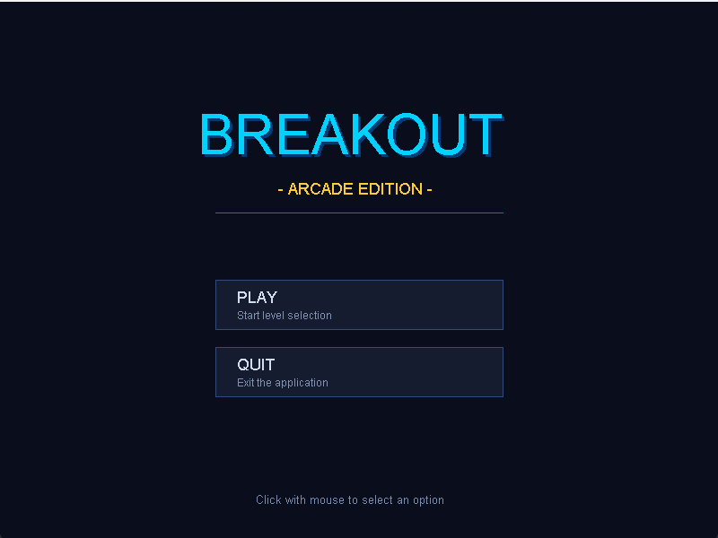
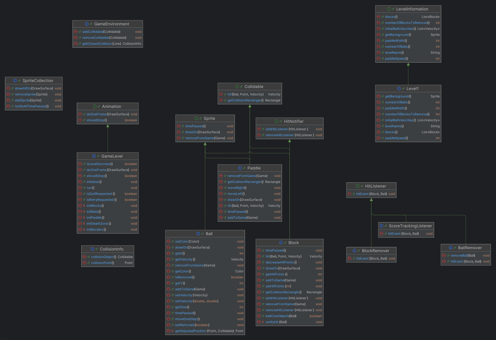

# Breakout: 2D Arcade Engine

A modular, deterministic 2D Breakout game engine built in Java. Architected around core Object-Oriented principles, decoupled spatial environments, continuous vector collision physics, and clean state management.



---

## Key Highlights

- **Pure OOP Architecture**: Decoupled visual sprites, spatial collidables, and event listeners adhering to SOLID principles.
- **Continuous 2D Collision Physics**: Trajectory vector intersections with surface-normal reflections and segmented paddle deflection angles.
- **5 Progressive Levels**: Modular difficulty scaling across ball counts, velocities, paddle sizes, and block durability matrices.
- **Complete Game Flow**: Mouse-driven navigation, session-based progressive level unlocking, and in-game pause with Resume, Retry, and Quit capabilities.
- **Robust State Management**: Isolated level instances, double-decrement collision guards, and clean score lifecycle scoping.



---

## Architecture & Design Patterns

### 1. Decoupled Spatial Environment (`Collidable` vs. `Sprite`)
- **`Collidable`**: Entities that occupy physical space and respond to collisions (`Rectangle` bounds, velocity reflection).
- **`Sprite`**: Visual entities updated every frame (`timePassed()`, `drawOn()`).
- **Composite Entities**: Classes like `Block` and `Paddle` implement both interfaces, separating collision queries from render passes.

### 2. Observer Pattern (Event-Driven Hit Cascade)
- Block collisions notify registered `HitListener` implementations without tight coupling:
  - **`BlockRemover`**: Tracks block durability and unregisters destroyed blocks from the game.
  - **`BallRemover`**: Captures death-zone crossings and updates active ball counts.
  - **`ScoreTrackingListener`**: Increments player score upon block impacts and clear bonuses.

### 3. State & Animation Framework
- **`Animation` & `AnimationRunner`**: Standardized interface driving a fixed 60 FPS update-and-render loop.
- **`GameFlow`**: Coordinates screen transitions between `MainMenuScreen`, `LevelSelectionScreen`, `GameLevel`, `PauseScreen`, and `LevelEndScreen`.

### 4. Modular Level Abstraction (`LevelInformation`)
- Declarative interface defining level parameters: ball counts, velocities, paddle specifications, block layouts, and backgrounds.
- New levels can be added without modifying core game loops or physics handlers (Open/Closed Principle).

### 5. Continuous 2D Vector Collision Detection
- Ball trajectories are modeled as directional ray segments ($\vec{P}_{next} = \vec{P}_{current} + \vec{V}$), checking intersection points against block bounding boxes to prevent tunneling.
- Collisions invert normal velocity components, while the paddle width is divided into 5 deflection zones that angle return vectors between $300^\circ$ and $60^\circ$.

---

## Level Specifications

| Level | Name | Balls & Velocities | Paddle (Width / Speed) | Durability & Blocks | Theme |
| :---: | :--- | :--- | :---: | :---: | :--- |
| **1** | **Direct Hit** | 1 Ball (Speed 4.5) | 160 px / Speed 7 | 1 Target Block (1 Hit) | Deep Space Radar |
| **2** | **Wide & Easy** | 2 Balls (Speed 4.6, 5.4; Staggered) | 220 px / Speed 6 | 15 Rainbow Blocks (1 Hit) | Sunny Meadows |
| **3** | **Brick Cascade** | 2 Balls (Speed 5.6, 6.4; Staggered) | 130 px / Speed 8 | 40 Pyramid Blocks (1–2 Hits) | Twilight Dusk |
| **4** | **Color Chaos** | 3 Balls (Speed 6.0, 6.5, 7.4; Staggered) | 100 px / Speed 9 | 60 Matrix Blocks (1–3 Hits) | Cyberpunk Neon |
| **5** | **Breakout Inferno**| 4 Balls (Speed 7.4, 7.8, 8.2, 8.8; Staggered)| 75 px / Speed 11 | 47 Fortress Blocks (1–3 Hits) | Volcanic Lava |

---

## Robustness & State Isolation

- **State Isolation**: Each level runs in an independent `GameLevel` instance, preventing stale collidables or listeners from leaking across transitions.
- **Guarded Ball Removal**: `Ball` entities encapsulate an `isRemoved` flag to prevent duplicate counter decrements from simultaneous collision and sweep triggers.
- **Score Scoping**: Retrying a level reverts the score to the start of that level; returning to menus resets the session score; points permanently commit only on level clear.

---

## Tech Stack & Dependencies

- **Language**: Java (JDK 8+)
- **Build Tool**: Apache Ant / pure `javac` CLI

---

## Quick Start

### Build & Run via Ant
```bash
ant run       # Compile and launch
ant clean     # Remove build artifacts
```

### Build & Run via CLI

**PowerShell (Windows):**
```powershell
$files = Get-ChildItem -Recurse -Filter *.java src | Select-Object -ExpandProperty FullName
javac -cp "bin;biuoop-1.4.jar" -d bin $files
java -cp "bin;biuoop-1.4.jar" BreakoutGame
```

**Bash (Linux / macOS):**
```bash
find src -name "*.java" > sources.txt
javac -cp "bin:biuoop-1.4.jar" -d bin @sources.txt
java -cp "bin:biuoop-1.4.jar" BreakoutGame
```
